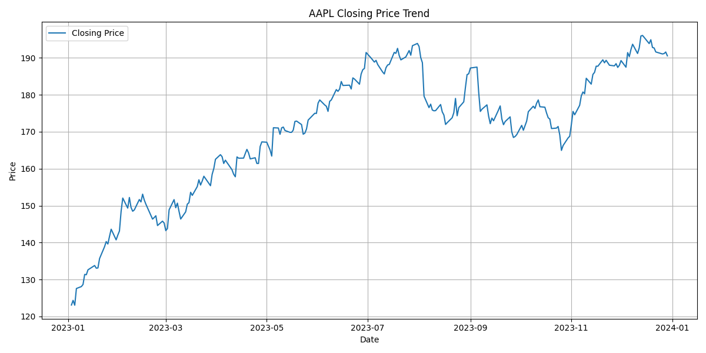
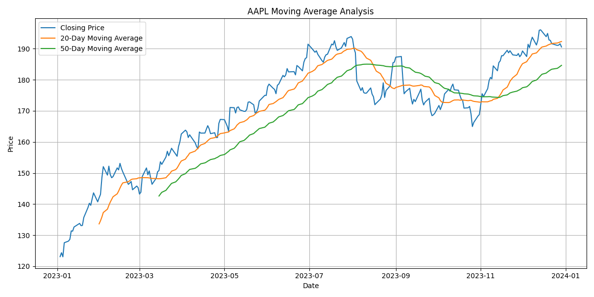
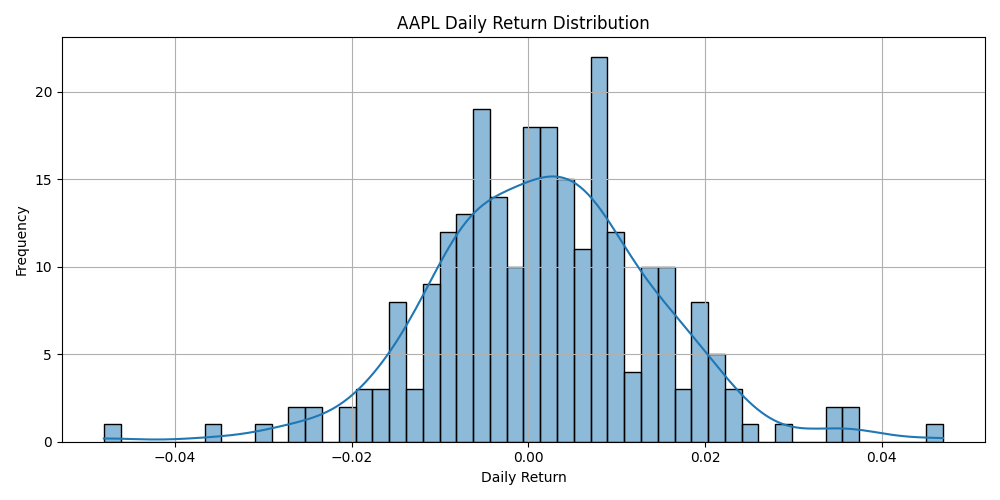
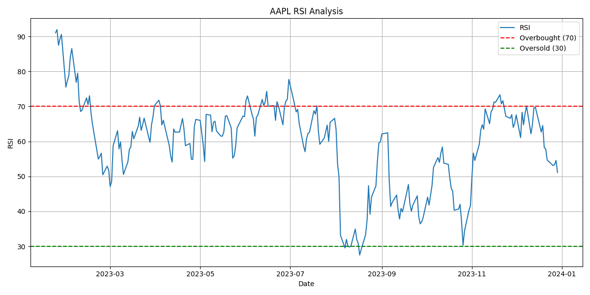
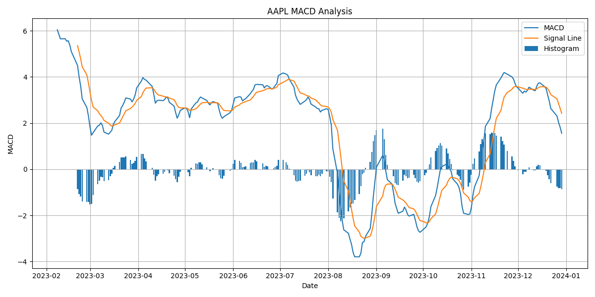

# 📈 Stock Market Data Analyzer

## 🚀 Project Overview

Stock Market Data Analyzer is an advanced Python-based financial analytics project that fetches real-time stock market data using the Yahoo Finance API and performs detailed financial analysis, technical indicator analysis, risk analysis, and visualization.

The project demonstrates how Python can be used for:

* Financial analytics
* Time-series analysis
* Technical analysis
* Data visualization
* Dashboard development
* FinTech applications

---

# 🎯 Problem Statement

Investors, analysts, and traders require automated systems to analyze stock market data efficiently.

Manual analysis is time-consuming and inefficient.

This project automates:

* Stock data collection
* Trend analysis
* Moving average analysis
* RSI technical indicator analysis
* Volatility analysis
* Return analysis
* Financial visualization
* Report generation

---

# 🏢 Industry Relevance

This project is useful for:

* Python Developers
* Data Analysts
* Financial Analysts
* Business Analysts
* FinTech Internships
* Investment Research Teams

Companies use similar systems for:

* Market trend analysis
* Risk analysis
* Investment research
* Portfolio monitoring
* Financial reporting

---

# ✨ Features

## 📊 Data Collection

* Real-time stock data fetching using Yahoo Finance API
* CSV export functionality
* Historical stock analysis

## 📈 Financial Analysis

* Daily return calculation
* Volatility analysis
* Highest and lowest price analysis
* Moving averages (20-Day & 50-Day)

## 🔥 Advanced Technical Indicators

* RSI (Relative Strength Index)
* MACD (Moving Average Convergence Divergence)

## 📉 Visualization

* Closing price trend chart
* Moving average chart
* Return distribution chart
* RSI analysis chart
* MACD analysis chart

## 📋 Reporting

* Automated stock analysis report generation
* Financial summary output

## 🌐 Dashboard

* Interactive Streamlit dashboard
* Dynamic stock ticker input
* Real-time chart visualization

---

# 🛠️ Tech Stack

| Technology | Purpose               |
| ---------- | --------------------- |
| Python     | Core Programming      |
| Pandas     | Data Analysis         |
| NumPy      | Numerical Computation |
| Matplotlib | Visualization         |
| Seaborn    | Statistical Charts    |
| yfinance   | Stock Market API      |
| Streamlit  | Interactive Dashboard |
| ta         | Technical Indicators  |
| Plotly     | Interactive Charts    |

---

# 📂 Project Structure

```text
Stock-Market-Data-Analyzer/
│
├── data/
│   └── AAPL_stock_data.csv
│
├── images/
│   ├── closing_price.png
│   ├── moving_average.png
│   ├── return_distribution.png
│   ├── rsi_analysis.png
│   └── macd_analysis.png
│
├── reports/
│   └── stock_report.txt
│
├── outputs/
│   └── processed_stock_data.csv
│
├── notebooks/
│   └── stock_analysis.ipynb
│
├── docs/
│   ├── architecture.png
│   ├── workflow.png
│   └── deployment_guide.md
│
├── src/
│   ├── data_loader.py
│   ├── analysis.py
│   ├── indicators.py
│   ├── visualization.py
│   └── report_generator.py
│
├── dashboard.py
├── main.py
├── requirements.txt
├── README.md
└── LICENSE
```

---

# ⚙️ Installation Guide

## 1️⃣ Clone Repository

```bash
git clone https://github.com/jatingujju/Stock-Market-Data-Analyzer.git
```

## 2️⃣ Navigate Into Project

```bash
cd Stock-Market-Data-Analyzer
```

## 3️⃣ Create Virtual Environment

### Windows

```bash
python -m venv venv
venv\Scripts\activate
```

### Mac/Linux

```bash
python3 -m venv venv
source venv/bin/activate
```

## 4️⃣ Install Dependencies

```bash
pip install -r requirements.txt
```

---

# ▶️ How To Run

## Run Main Project

```bash
python main.py
```

## Run Streamlit Dashboard

```bash
streamlit run dashboard.py
```

---

# 📊 Sample Output

## Example Financial Summary

```text
Highest Price : 197.57
Lowest Price  : 122.21
Volatility    : 0.01257
Average Return: 0.00183
```

---
# 📸 Screenshots

## 📈 Closing Price Trend



---

## 📉 Moving Average Analysis



---

## 📊 Return Distribution



---

## 🔥 RSI Analysis



---

## 📈 MACD Analysis



---

# 📋 Learning Outcomes

Through this project I learned:

* Financial data analysis
* API integration
* Time-series analysis
* Technical indicators
* Data visualization
* Dashboard development
* Python automation
* GitHub project management
* Streamlit deployment

---

# 🌐 Future Improvements

* Candlestick charts
* Portfolio tracker
* Machine learning stock prediction
* Multi-stock comparison
* Database integration
* Real-time stock updates
* Sentiment analysis

---

# ⚠️ Disclaimer

This project is created for educational and portfolio purposes only.

It does not provide financial or investment advice.

Always perform your own research before making investment decisions.

---

# 👨‍💻 Author

Jatin Gujarathi

GitHub: [https://github.com/jatingujju](https://github.com/jatingujju)
